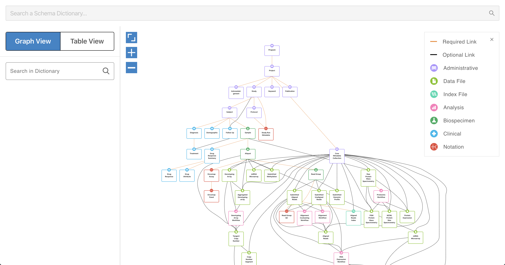
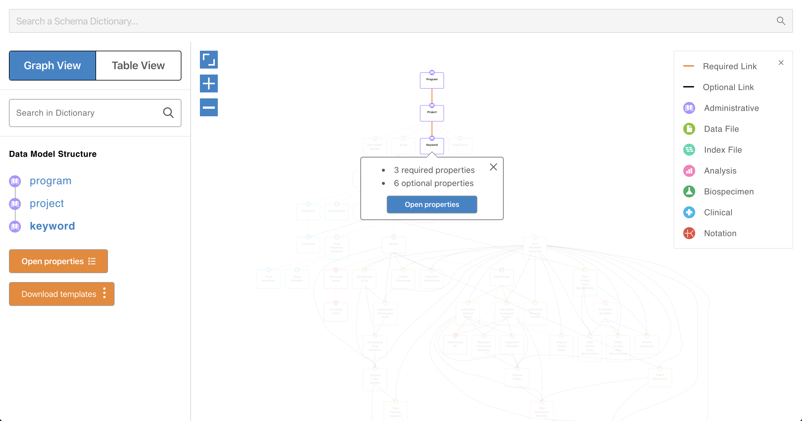

<h1 align="center">Data Model Viewer</h1>
<div align="center">
A viewer for data dictionary based on <a href="https://github.com/uc-cdis/data-portal">Windmill</a>.
</div>
<br>
<div align="center" >

[](./LICENSE)

</div>


[Demo](http://webapps.3steps.cn/data-model/)
---






## Available Scripts

In the project directory, you can run:

### `yarn start`

Runs the app in the development mode.<br />
Open [http://localhost:3000](http://localhost:3000) to view it in the browser.

The page will reload if you make edits.<br />
You will also see any lint errors in the console.

### `yarn build`

Builds the app for production to the `build` folder.<br />
It correctly bundles React in production mode and optimizes the build for the best performance.

The build is minified and the filenames include the hashes.<br />
Your app is ready to be deployed!

### Deployment

```
yarn global add serve
yarn build
serve -s build
```

## TODO
- [ ] Add search box to support view the external json file of data dictionary.